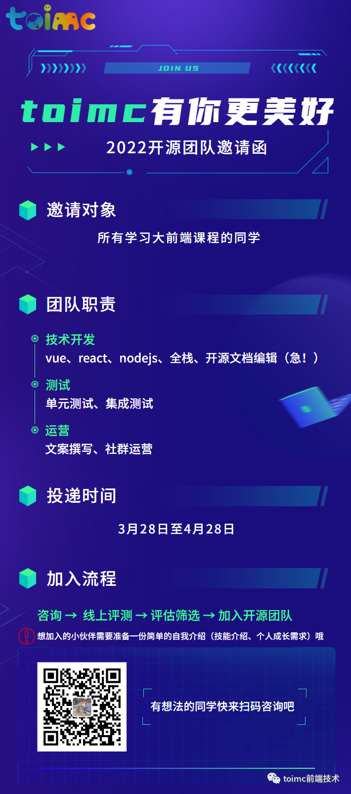

# vue-toimc-admin

[中文](./README.md) | English

<div align="center"> <a href="https://github.com/toimc-team/vue3-toimc-admin">  </a> <br> <br>
</div>

> Vue 3.0 + TypeScript + Vite + Element-plus based administration backend project
>
> Rich base components and business functional components, 100% more efficient

[](LICENSE)     

Hello, guys, we are the toimc open source project team, in this article we will briefly introduce the current phase of our open source project planning, to help you to understand our open source plans, to understand our team.

Domestic mirror site: [https://gitee.com/toimc-team/vue3-toimc-admin](https://gitee.com/toimc-team/vue3-toimc-admin)

## Origins

On 7 February 2022, Vue 3 became the new default version.

There are many excellent middle and backend solutions based on Vue 3, such as NaiveAdmin, vue-vben-admin, vue-admin-better, etc., but there is a lack of ecology, cross-end solutions and security solutions related to these solutions, so we wanted to build an enterprise-class cross-end front and backend solution with a good ecology. solution.

## Project Development

Version requirements.

- Node LTS 14+
- pnpm 6.x+/yarn/npm

Installed dependencies.

```
# recommand
pnpm i

# or
yarn install

# or
npm install
```

Run the project.

```
npm run dev
```

Packages.

```
npm run build
```

## Project Directory

```bash
.
├── LICENSE
├── README.md
├── auto-imports.d.ts
├── build                # Build related scripts
├── commitlint.config.js # commit lint
├── components.d.ts
├── index.html
├── jsconfig.json
├── mock                 # mock APIs
├── package.json
├── pnpm-lock.yaml
├── postcss.config.js    # postcss config
├── public
├── src                  # source code
│   ├── App.vue          # root component
│   ├── assets           # static assets
│   ├── components
│   ├── directive
│   ├── env.d.ts
│   ├── layouts
│   ├── main.ts
│   ├── plugins
│   ├── router
│   ├── settings
│   ├── store
│   ├── utils
│   └── views
├── stylelint.config.js
├── tsconfig.json
├── tsconfig.node.json
├── types
├── vite.config.ts
└── windi.config.ts
```

## Background and description

### Product advantages

- Open source version free for commercial use
- Using the latest technology stack vue3+typescript+vite
- Complete community ecosystem
- RBAC and JWT based authentication mechanism
- Enterprise-class front-end security solution
- Flexible switching between multiple themes and layouts
- Fast iterations

### Progress

At this stage it contains login, layout, menu routing and common base components.

We are also building a documentation site for our open source project, and hope to create an excellent project documentation that can be used out of the box by students using our open source project.

The whole open source team has been formed, including product, development, operations a total of 8 people of partners, every day the partners are happy to discuss technical.

Plan progress: [Github issues label: Plan](https://github.com/toimc-team/vue3-toimc-admin/issues?q=is%3Aissue+is%3Aopen+sort%3Aupdated-desc+ label%3Aplan)

### Future planning

After the current phase is complete, we will continue to enrich our base components, adding highly available business components, unit testing solutions and front-end security solutions. We will also build a technical community, knowledge payment and a point system around our open source projects to provide a platform for technical exchange and sharing and content realisation for those who participate in our open source projects and use them.

## How to join

Talent requirements.

- Front-end: Vue,React,Nodejs
- Backend: java,go,python,C++/C
- Testing
- Operation: copywriting, shake, community



## How to contribute

- Join the WeChat group
- Learn about benchmarking projects
  - Vben: https://vvbin.cn/next/#/dashboard/analysis
  - Vue-admin: https://vue-admin-beautiful.com/admin-plus/
  - arco: https://react-pro.arco.design/dashboard/monitor
  - Naive: https://naive-ui-admin.vercel.app/#/dashboard/console
- See if there are plans and discussions in issues.
  - Plan: [enhancement](https://github.com/toimc-team/vue3-toimc-admin/issues?q=is%3Aissue+is%3Aopen+label%3Aenhancement)
  - Discussion: [discussion](https://github.com/toimc-team/vue3-toimc-admin/issues?q=is%3Aissue+is%3Aopen+label%3Adiscussion)
- (not required) create your own issues and join the project
- Download the project, coding, test~~
- PR: [here](https://github.com/toimc-team/vue3-toimc-admin/pulls?q=is%3Apr+is%3Aopen+sort%3Aupdated-desc)
- Wait for review, merge~~

## Donate

If you think this project is helpful to you, you can help the author buy a cup of coffee to show your support!


Paypal：[https://paypal.me/toimc](https://paypal.me/toimc)
